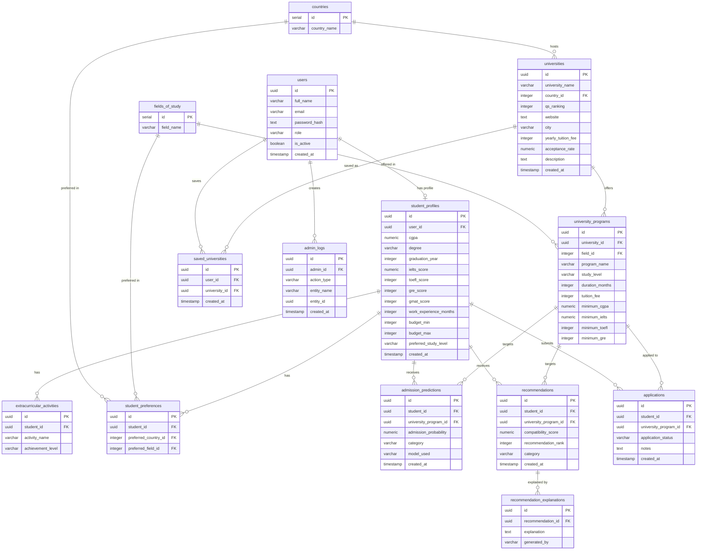

# Database Documentation — FYP Project

> **Source of truth:** PostgreSQL on Supabase  
> **ORM:** SQLAlchemy 2.x  
> **Migrations:** Alembic  

---

## 1. ER Diagram



---

## 2. Table Definitions

### users

| Column | Type | Nullable | Notes |
|---|---|---|---|
| id | UUID | NO | PK, auto-generated via gen_random_uuid() |
| full_name | VARCHAR(255) | YES | |
| email | VARCHAR(255) | NO | UNIQUE |
| password_hash | TEXT | YES | bcrypt hash |
| role | VARCHAR(20) | YES | `admin` or `student` |
| is_active | BOOLEAN | YES | default `true` |
| created_at | TIMESTAMP | YES | server default NOW() |

---

### student_profiles

| Column | Type | Nullable | Notes |
|---|---|---|---|
| id | UUID | NO | PK |
| user_id | UUID | NO | FK → users.id, UNIQUE (1-to-1) |
| cgpa | NUMERIC(3,2) | YES | e.g. 3.75 |
| degree | VARCHAR(100) | YES | |
| graduation_year | INTEGER | YES | |
| ielts_score | NUMERIC(3,1) | YES | e.g. 7.5 |
| toefl_score | INTEGER | YES | |
| gre_score | INTEGER | YES | |
| gmat_score | INTEGER | YES | |
| work_experience_months | INTEGER | YES | |
| budget_min | INTEGER | YES | USD |
| budget_max | INTEGER | YES | USD |
| preferred_study_level | VARCHAR(50) | YES | e.g. Masters |
| created_at | TIMESTAMP | YES | |

---

### countries

| Column | Type | Nullable |
|---|---|---|
| id | SERIAL | NO |
| country_name | VARCHAR(100) | YES |

Seeded values: USA, Canada, UK, Germany, Australia, Ireland

---

### fields_of_study

| Column | Type | Nullable |
|---|---|---|
| id | SERIAL | NO |
| field_name | VARCHAR(200) | YES |

Seeded values: Computer Science, Data Science, Artificial Intelligence, Software Engineering, Cyber Security

---

### universities

| Column | Type | Nullable | Notes |
|---|---|---|---|
| id | UUID | NO | PK |
| university_name | VARCHAR(255) | YES | |
| country_id | INTEGER | YES | FK → countries.id |
| qs_ranking | INTEGER | YES | |
| website | TEXT | YES | |
| city | VARCHAR(100) | YES | |
| yearly_tuition_fee | INTEGER | YES | USD |
| acceptance_rate | NUMERIC(5,2) | YES | Percentage |
| description | TEXT | YES | |
| created_at | TIMESTAMP | YES | |

---

### university_programs

| Column | Type | Nullable | Notes |
|---|---|---|---|
| id | UUID | NO | PK |
| university_id | UUID | YES | FK → universities.id |
| field_id | INTEGER | YES | FK → fields_of_study.id |
| program_name | VARCHAR(255) | YES | |
| study_level | VARCHAR(50) | YES | Bachelors / Masters / PhD |
| duration_months | INTEGER | YES | |
| tuition_fee | INTEGER | YES | USD |
| minimum_cgpa | NUMERIC(3,2) | YES | |
| minimum_ielts | NUMERIC(3,1) | YES | |
| minimum_toefl | INTEGER | YES | |
| minimum_gre | INTEGER | YES | |

---

### extracurricular_activities

| Column | Type | Nullable |
|---|---|---|
| id | UUID | NO |
| student_id | UUID | YES |
| activity_name | VARCHAR(255) | YES |
| achievement_level | VARCHAR(100) | YES |

---

### student_preferences

| Column | Type | Nullable |
|---|---|---|
| id | UUID | NO |
| student_id | UUID | YES |
| preferred_country_id | INTEGER | YES |
| preferred_field_id | INTEGER | YES |

---

### admission_predictions

| Column | Type | Nullable | Notes |
|---|---|---|---|
| id | UUID | NO | PK |
| student_id | UUID | YES | FK → student_profiles.id |
| university_program_id | UUID | YES | FK → university_programs.id |
| admission_probability | NUMERIC(5,2) | YES | 0.00 – 100.00 |
| category | VARCHAR(20) | YES | SAFE / MODERATE / REACH |
| model_used | VARCHAR(100) | YES | |
| created_at | TIMESTAMP | YES | |

---

### recommendations

| Column | Type | Nullable |
|---|---|---|
| id | UUID | NO |
| student_id | UUID | YES |
| university_program_id | UUID | YES |
| compatibility_score | NUMERIC(5,2) | YES |
| recommendation_rank | INTEGER | YES |
| category | VARCHAR(20) | YES |
| created_at | TIMESTAMP | YES |

---

### recommendation_explanations

| Column | Type | Nullable | Notes |
|---|---|---|---|
| id | UUID | NO | |
| recommendation_id | UUID | YES | FK → recommendations.id |
| explanation | TEXT | YES | |
| generated_by | VARCHAR(50) | YES | default `OpenAI` |

---

### saved_universities

| Column | Type | Nullable |
|---|---|---|
| id | UUID | NO |
| user_id | UUID | YES |
| university_id | UUID | YES |
| created_at | TIMESTAMP | YES |

---

### applications

| Column | Type | Nullable | Notes |
|---|---|---|---|
| id | UUID | NO | |
| student_id | UUID | YES | FK → student_profiles.id |
| university_program_id | UUID | YES | FK → university_programs.id |
| application_status | VARCHAR(50) | YES | Applied / Pending / Accepted / Rejected |
| notes | TEXT | YES | |
| created_at | TIMESTAMP | YES | |

---

### admin_logs

| Column | Type | Nullable |
|---|---|---|
| id | UUID | NO |
| admin_id | UUID | YES |
| action_type | VARCHAR(100) | YES |
| entity_name | VARCHAR(100) | YES |
| entity_id | UUID | YES |
| created_at | TIMESTAMP | YES |

---

## 3. Relationships

| Parent Table | Child Table | Type | Join Column |
|---|---|---|---|
| users | student_profiles | 1 : 1 | student_profiles.user_id → users.id |
| users | saved_universities | 1 : many | saved_universities.user_id → users.id |
| users | admin_logs | 1 : many | admin_logs.admin_id → users.id |
| countries | universities | 1 : many | universities.country_id → countries.id |
| countries | student_preferences | 1 : many | student_preferences.preferred_country_id → countries.id |
| fields_of_study | university_programs | 1 : many | university_programs.field_id → fields_of_study.id |
| fields_of_study | student_preferences | 1 : many | student_preferences.preferred_field_id → fields_of_study.id |
| universities | university_programs | 1 : many | university_programs.university_id → universities.id |
| universities | saved_universities | 1 : many | saved_universities.university_id → universities.id |
| student_profiles | extracurricular_activities | 1 : many | extracurricular_activities.student_id → student_profiles.id |
| student_profiles | student_preferences | 1 : many | student_preferences.student_id → student_profiles.id |
| student_profiles | admission_predictions | 1 : many | admission_predictions.student_id → student_profiles.id |
| student_profiles | recommendations | 1 : many | recommendations.student_id → student_profiles.id |
| student_profiles | applications | 1 : many | applications.student_id → student_profiles.id |
| university_programs | admission_predictions | 1 : many | admission_predictions.university_program_id → university_programs.id |
| university_programs | recommendations | 1 : many | recommendations.university_program_id → university_programs.id |
| university_programs | applications | 1 : many | applications.university_program_id → university_programs.id |
| recommendations | recommendation_explanations | 1 : many | recommendation_explanations.recommendation_id → recommendations.id |

---

## 4. Foreign Keys

| Table | Column | References | On Delete |
|---|---|---|---|
| student_profiles | user_id | users(id) | CASCADE |
| universities | country_id | countries(id) | SET NULL |
| university_programs | university_id | universities(id) | CASCADE |
| university_programs | field_id | fields_of_study(id) | SET NULL |
| extracurricular_activities | student_id | student_profiles(id) | CASCADE |
| student_preferences | student_id | student_profiles(id) | CASCADE |
| student_preferences | preferred_country_id | countries(id) | SET NULL |
| student_preferences | preferred_field_id | fields_of_study(id) | SET NULL |
| admission_predictions | student_id | student_profiles(id) | CASCADE |
| admission_predictions | university_program_id | university_programs(id) | CASCADE |
| recommendations | student_id | student_profiles(id) | CASCADE |
| recommendations | university_program_id | university_programs(id) | CASCADE |
| recommendation_explanations | recommendation_id | recommendations(id) | CASCADE |
| saved_universities | user_id | users(id) | CASCADE |
| saved_universities | university_id | universities(id) | CASCADE |
| applications | student_id | student_profiles(id) | CASCADE |
| applications | university_program_id | university_programs(id) | CASCADE |
| admin_logs | admin_id | users(id) | SET NULL |

---

## 5. Constraints

| Table | Constraint Name | Type |
|---|---|---|
| users | uq_users_email | UNIQUE |
| student_profiles | uq_student_profiles_user_id | UNIQUE |
| All UUID tables | — | PK via gen_random_uuid() |
| countries | — | SERIAL (auto-increment) PK |
| fields_of_study | — | SERIAL (auto-increment) PK |

---

## 6. Indexes

| Table | Index Name | Type | Column(s) |
|---|---|---|---|
| users | ix_users_email | UNIQUE B-tree | email |
| All PK columns | auto (PostgreSQL) | B-tree | primary key |

> **Note:** Additional indexes on FK columns (e.g. `student_profiles.user_id`, `university_programs.university_id`) should be added as query patterns emerge during development.

---

## 7. Query Optimization Notes

1. **UUID primary keys** — PostgreSQL stores UUIDs efficiently as 16-byte values. Use `gen_random_uuid()` (requires pgcrypto) to avoid sequential UUID attacks.

2. **Admission prediction lookups** — Most queries will filter by `student_id` and order by `admission_probability`. Consider:
   ```sql
   CREATE INDEX ix_admission_predictions_student_id
       ON admission_predictions(student_id, admission_probability DESC);
   ```

3. **Recommendation ranking** — Frequent query pattern: top-N by student. Consider:
   ```sql
   CREATE INDEX ix_recommendations_student_rank
       ON recommendations(student_id, recommendation_rank ASC);
   ```

4. **Application status filtering** — Common dashboard query:
   ```sql
   CREATE INDEX ix_applications_student_status
       ON applications(student_id, application_status);
   ```

5. **University search** — Full-text or partial match on `university_name`:
   ```sql
   CREATE INDEX ix_universities_name_gin
       ON universities USING gin(to_tsvector('english', university_name));
   ```

6. **Avoid N+1** — Always use SQLAlchemy `joinedload` or `selectinload` when fetching students with their profiles, preferences, and activities.

7. **Pagination** — Use keyset pagination (WHERE id > last_seen_id ORDER BY id LIMIT n) over OFFSET for large result sets.

---

## 8. Example Queries

### Get a student's full profile

```sql
SELECT
    u.full_name,
    u.email,
    sp.cgpa,
    sp.degree,
    sp.graduation_year,
    sp.ielts_score,
    sp.budget_min,
    sp.budget_max,
    sp.preferred_study_level
FROM users u
JOIN student_profiles sp ON sp.user_id = u.id
WHERE u.id = '<user-uuid>';
```

---

### Get recommendations for a student with program details

```sql
SELECT
    r.recommendation_rank,
    r.compatibility_score,
    r.category,
    up.program_name,
    up.study_level,
    up.tuition_fee,
    univ.university_name,
    c.country_name
FROM recommendations r
JOIN university_programs up ON up.id = r.university_program_id
JOIN universities univ ON univ.id = up.university_id
JOIN countries c ON c.id = univ.country_id
WHERE r.student_id = '<student-profile-uuid>'
ORDER BY r.recommendation_rank ASC;
```

---

### Get admission predictions categorised by chance

```sql
SELECT
    category,
    COUNT(*) AS count,
    AVG(admission_probability) AS avg_probability
FROM admission_predictions
WHERE student_id = '<student-profile-uuid>'
GROUP BY category
ORDER BY CASE category
    WHEN 'SAFE'     THEN 1
    WHEN 'MODERATE' THEN 2
    WHEN 'REACH'    THEN 3
END;
```

---

### Universities in a country with programs for a given field

```sql
SELECT
    univ.university_name,
    univ.qs_ranking,
    univ.yearly_tuition_fee,
    up.program_name,
    up.study_level,
    up.minimum_cgpa
FROM universities univ
JOIN university_programs up ON up.university_id = univ.id
JOIN fields_of_study fos ON fos.id = up.field_id
JOIN countries c ON c.id = univ.country_id
WHERE c.country_name = 'Canada'
  AND fos.field_name = 'Computer Science'
ORDER BY univ.qs_ranking ASC NULLS LAST;
```

---

### Student's application history

```sql
SELECT
    app.application_status,
    app.created_at,
    up.program_name,
    univ.university_name
FROM applications app
JOIN university_programs up ON up.id = app.university_program_id
JOIN universities univ ON univ.id = up.university_id
WHERE app.student_id = '<student-profile-uuid>'
ORDER BY app.created_at DESC;
```

---

### Admin activity log (last 50 actions)

```sql
SELECT
    al.created_at,
    u.full_name  AS admin_name,
    al.action_type,
    al.entity_name,
    al.entity_id
FROM admin_logs al
JOIN users u ON u.id = al.admin_id
ORDER BY al.created_at DESC
LIMIT 50;
```

---

## 9. Data Flow

```
User Registration
      │
      ▼
  users table ──────────────────────────────────────────►  admin_logs
      │                                                          ▲
      │ 1:1                                                      │
      ▼                                                     admin users
 student_profiles ──────────────────────────────────────► saved_universities
      │                                                          │
      ├──► extracurricular_activities                            ▼
      │                                                     universities
      ├──► student_preferences                                    │
      │         │                                                 │ 1:many
      │         ├──► countries                                    ▼
      │         └──► fields_of_study ──────────────► university_programs
      │                                                           │
      ├──► admission_predictions ◄────────────────────────────────┤
      │                                                           │
      ├──► recommendations ◄──────────────────────────────────────┤
      │         │                                                 │
      │         └──► recommendation_explanations                  │
      │                                                           │
      └──► applications ◄──────────────────────────────────────────┘
```

**Flow summary:**
1. A `user` registers with role `student`
2. A `student_profile` is created (1:1 with user)
3. The student sets `student_preferences` (countries + fields)
4. The system queries matching `university_programs` across `universities`
5. ML models produce `admission_predictions` (SAFE / MODERATE / REACH)
6. The recommendation engine ranks programs → `recommendations`
7. OpenAI generates `recommendation_explanations` for each recommendation
8. The student browses, saves via `saved_universities`, and submits `applications`
9. Admins manage the platform; all admin actions are logged in `admin_logs`
